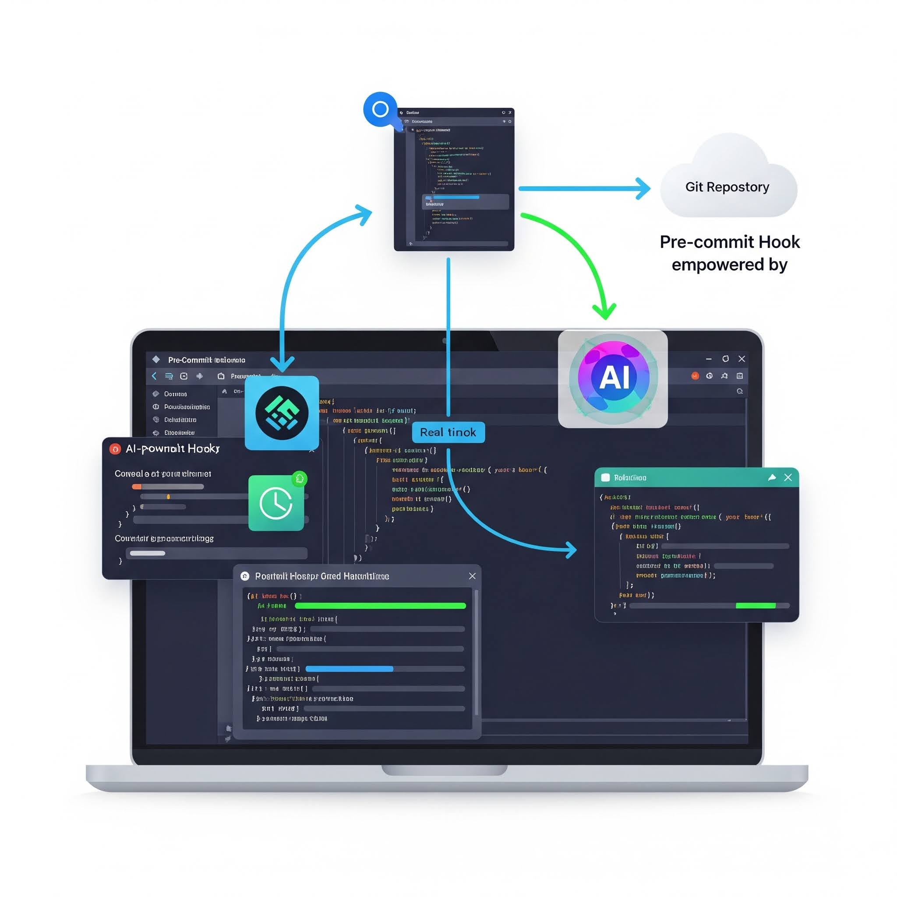

# AI SQL Reviewer Hook

 

This pre-commit hook automates the review of SQL code using Google's Generative AI (GenAI). It helps ensure your SQL scripts adhere to predefined coding standards, best practices, and stylistic guidelines by providing AI-powered feedback.

## Features

*   **Automated Code Review:** Analyzes `.sql` files for adherence to standards.
*   **AI-Powered Feedback:** Leverages Google GenAI models for insightful review comments.
*   **Configurable Standards:** Define your coding standards and best practices in `system_context.md`.
*   **Customizable Prompts:** Tailor the review instructions in `system_prompt.md`.
*   **Remote Hook:** Easily shareable across projects and version-controlled via Git tags.

## Requirements

*   **Python 3.8+**: The environment where `pre-commit` runs must have a compatible Python interpreter.
*   **Google Cloud Credentials:** The hook requires access to Google Cloud services. This is typically handled via:
    *   **Application Default Credentials (ADC):** Run `gcloud auth application-default login` on your machine.
    *   **`GOOGLE_APPLICATION_CREDENTIALS` Environment Variable:** Set this to the path of your service account JSON key file.
*   **`pre-commit` Framework:** You need to have `pre-commit` installed: `pip install pre-commit`.

## Installation

To use this hook in your project, add the following to your project's `.pre-commit-config.yaml` file:

```yaml
# .pre-commit-config.yaml (in your main project's root)

repos:
    - repo: https://github.com/kev-pinto-qodea/ai-sql-reviewer-hook
    rev: v0.1.0 # Use the latest stable version
    hooks:
      - id: ai-sql-review 
        pass_filenames: false # DO NOT CHANGE FOR NOW 
        args:
          - "--project=xxx-sbx-1f2-xxxx-hermann"
          - "--location=europe-west4"
          - "--sql_dir=./sql" # Directory containing SQL files
      # pre-commit inherently handles the files it matches.
      # Your script receives the files as positional arguments.
```

## Configuration
This hook uses two configuration files, which should be placed in the root of this hook repository (i.e., your ai-sql-reviewer-hook repository):

`system_context.md`
This file should contain the overall guidelines, coding standards, best practices, architectural principles, or any other context you want the AI to consider during the review.

Example:
You are a senior SQL code reviewer.
Review the provided SQL code against the following principles:
- Adhere to standard SQL syntax.
- Avoid SELECT *. Use explicit column names.
- Use clear and descriptive aliases for tables and columns.
- Ensure consistent formatting (indentation, capitalization).
- Add comments for complex logic.
- Optimize for readability and performance where possible.
- Follow naming conventions for tables, columns, and views.

`system_prompt.md`
This file defines the specific prompt or instruction for each review interaction. It can use a {filename} placeholder, which will be replaced by the name of the SQL file being reviewed.

Example:

Please review the following SQL file: '{filename}'.
Provide a detailed QA report highlighting any issues or suggestions based on the system context provided.
Format your output as a markdown list of findings, with each finding including:
1. A brief description of the issue.
2. The specific SQL code snippet if applicable.
3. A recommendation for improvement.
If the code is compliant, state that clearly.


## Releasing New Versions
When you make changes to this hook, it's important to version them properly to ensure reproducibility and stability in projects that use the hook.

Commit your changes in your ai-sql-reviewer-hook repository. Make sure your pyproject.toml or setup.py is up-to-date with dependencies and that ai_code_reviewer.py is at the root.
Create a new Git tag (e.g., v0.1.2, v0.2.0). It's highly recommended to follow Semantic Versioning (SemVer).

#### Example: Creating a patch version tag
`git tag -a v0.1.2 -m "v0.1.2: Added better error handling and prompt fixes"`

#### Example: Creating a minor version tag for new features
`git tag -a v0.2.0 -m "v0.2.0: Improved performance analysis capability"`

#### Example: Creating a major version tag for breaking changes Push the new tag to your remote repository
`git push origin v0.1.2`


#### For all project Referring to this hook
* Update the rev in your main project's .pre-commit-config.yaml file to point to the newly created tag.

* Re-install hooks in your main project to fetch the updated version:
pre-commit install

* Alternatively, pre-commit autoupdate can help manage updates across multiple remote hooks.

* This process ensures that your project always uses a specific, stable, and tested version of the AI SQL Reviewer hook.


#### Pending Features
This hook currently reads all files in a particular folder.
The code needs to be changed to deal with only the files passed to it by pre-commit.
